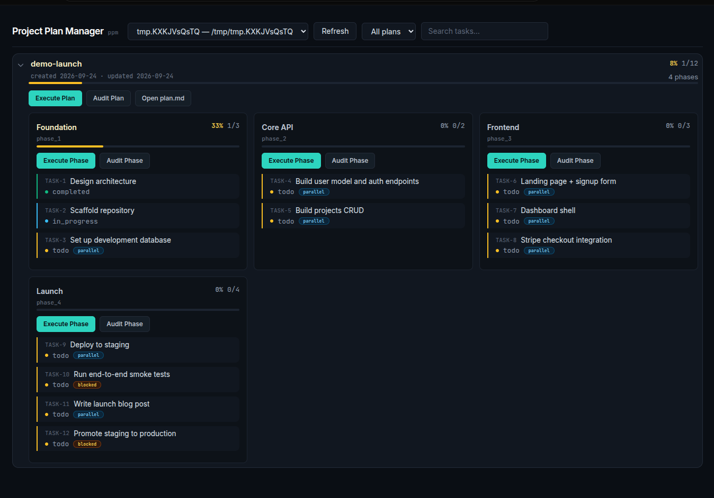

# Agent Harness Skill: Project Plan Manager

Agent Skill and CLI for structured project plans, phased JSON tasks, progress tracking, and a local dashboard.

Canonical layout: lowercase hyphenated `project-plan-manager/SKILL.md` plus three routed flow files under `prompts/`: `planning-flow.md`, `execution-flow.md`, and `audition-flow.md`. `SKILL.md` routes requests to the mandatory flow prompt; this layout is usable by OpenCode, Claude Code, Codex, and other Agent Skills-compatible clients.



## Features

- Create and manage `.ppm/<plan-name>/` project plans.
- Track ordered phases and task status with a JSON contract.
- Register project roots in a user-local configuration file.
- Serve a local dashboard bound to `127.0.0.1`.
- Migrate legacy `docs/plans/` layouts.

## Requirements

- Node.js >=18
- An Agent Skills-compatible client for skill instructions

## Installation

### One-shot installer

The repo ships with `install.sh`, which copies (or symlinks) the skill into the chosen agent's skills directory and runs `npm link` so `ppm` becomes available globally.

```bash
git clone <repository-url> project-plan-manager
cd project-plan-manager
./install.sh                            # copy mode, OpenCode
./install.sh --client claude            # Claude Code
./install.sh --client codex             # Codex
./install.sh --client all               # install for all three at once
./install.sh --mode link                # symlink source repo (live development)
./install.sh --uninstall                # remove skill + unlink ppm
```

Requires Node.js >=18 and `npm` on `PATH`. POSIX shell (Linux/macOS); Windows users should run under WSL or Git Bash.

### Manual installation

#### OpenCode default skills directory

```bash
git clone <repository-url> ~/.config/opencode/skills/project-plan-manager
cd ~/.config/opencode/skills/project-plan-manager
npm link
```

#### Claude Code user skill directory

```bash
git clone <repository-url> ~/.claude/skills/project-plan-manager
cd ~/.claude/skills/project-plan-manager
npm link
```

#### Codex user skill directory

Copy or clone the folder into the Agent Skills-compatible user skills location configured for Codex, commonly `~/.agents/skills/project-plan-manager`, then run `npm link` from the cloned package directory.

#### Generic Agent Skills-compatible client

Copy or clone the folder into the client's configured skills directory, preserving the lowercase hyphenated folder name:

```json
{
  "skills": {
    "paths": ["/path/to/project-plan-manager"]
  }
}
```

From the cloned package directory, each installation flow exposes `ppm` globally:

```bash
npm link
```

`npm link` normally creates a global `ppm` shim. The npm global executable directory must also be on `PATH`.

```bash
command -v ppm
npm prefix -g
```

On Unix/macOS, the executable is usually under `<prefix>/bin`. If `command -v ppm` returns nothing, add the directory represented by your own `npm prefix -g` output to your shell `PATH`, for example:

```bash
export PATH="<prefix>/bin:$PATH"
```

Persist that change only after reviewing the appropriate shell profile. Never edit a shell profile silently. On Windows, ensure the npm global prefix directory is on `PATH`; verify with `where ppm`. Restart the terminal and agent client after changing `PATH` or installing/configuring the skill.

If the shim is missing, run `npm link` again from the package directory. Do not use the package's full `bin/ppm.js` path as the routine invocation.

### Optional automatic-use setup

The skill can be enabled automatically for planning, execution, and plan audits through the user-level `AGENTS.md` used by your client. The path depends on the client and environment; it is not necessarily the project `AGENTS.md`. Editing it requires explicit consent. Follow [prompts/installation-flow.md](prompts/installation-flow.md), which asks before any external configuration change.

Users may manually add this bounded block after confirming the actual user-level file:

```markdown
<!-- project-plan-manager:start -->
For planning, executing/resuming plans, or auditing plans before execution, load and use the `project-plan-manager` skill. Follow its routed prompt files and use the `ppm` CLI.
<!-- project-plan-manager:end -->
```

## Usage

Run the CLI from a project root, or pass `--project <path>` to target another project. Run `ppm` with no arguments to print the usage block.

### Setup

```bash
ppm init [--plan <name>] [--project <path>]
ppm plan_init --plan <name> [--project <path>]
ppm migrate [--project <path>] [--dry-run]
ppm clean_roots [--dry-run]
ppm dashboard_serve [--project <path>] [--port <port>]
ppm check_dashboard [--port <port>]
```

### Tasks

```bash
ppm task_list --plan <name> --phase <phase_x> [--project <path>]
ppm task_ready --plan <name> --phase <phase_x> [--project <path>]
ppm task_blocked --plan <name> --phase <phase_x> [--project <path>]
ppm task_get --plan <name> --phase <phase_x> --task-id <id> [--project <path>]
ppm task_in_progress --plan <name> --phase <phase_x> --task-id <id> [--project <path>]
ppm task_completed --plan <name> --phase <phase_x> --task-id <id> [--project <path>]
ppm task_fail --plan <name> --phase <phase_x> --task-id <id> [--project <path>]
ppm task_reset --plan <name> --phase <phase_x> --task-id <id> [--project <path>]
ppm task_write_progress --plan <name> --phase <phase_x> --task-id <id> --progress-text <text> [--project <path>]
```

`plan_init` is a backward-compatible alias for `init --plan`. Phases execute strictly in numeric order. Inside a phase, tasks with no `pre_request` (or `pre_request: []`) can run in parallel; tasks with `pre_request` entries wait until each listed task is `completed`. `ppm task_ready` lists the currently runnable tasks in a phase.

See [SKILL.md](SKILL.md) for mandatory routing. Follow [planning-flow.md](prompts/planning-flow.md), [execution-flow.md](prompts/execution-flow.md), [audition-flow.md](prompts/audition-flow.md), or [installation-flow.md](prompts/installation-flow.md) for the applicable workflow.

## Data and configuration locations

- Project plans and task data: `<project>/.ppm/`
- Registered project roots: `~/.config/project-plan-manager/config.json`
- Dashboard: served from the package's `templates/task.html`; it is not copied into projects.

## Security and privacy

The CLI writes project paths and task data locally. Do not publish `config.json`, `.ppm/`, project plans, task progress, or other private project data. Review staged files before publishing this package. The dashboard binds to `127.0.0.1` by default and is not an authenticated service.

## Development verification

From the package directory:

```bash
npm run check
ppm
npm pack --dry-run
```

The no-argument `ppm` command is expected to print usage/error output and exit nonzero.
