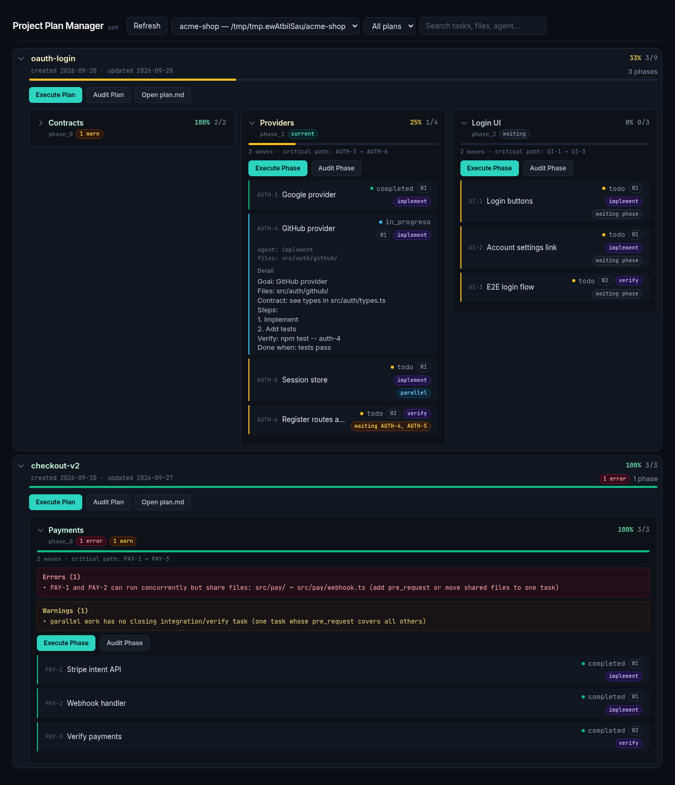

# Project Plan Manager

Agent Skill and zero-dependency CLI (`ppm`) for planning, executing, and auditing multi-phase project plans with AI coding agents, designed for orchestrators that dispatch work to parallel sub agents.

Works with OpenCode, Claude Code, Codex, and any Agent Skills-compatible client.



## Features

- **Structured plans**: `plan.md` plus one JSON file per phase under `<project>/.ppm/<plan>/`.
- **Parallel-aware scheduling**: phases are sync barriers; tasks inside a phase run in waves driven by `pre_request` dependencies.
- **File ownership**: each task declares the files it may modify. `plan_validate` rejects plans where concurrent tasks own the same file.
- **Sub-agent role hints**: `agent: explore | implement | review | verify` lets the orchestrator pick the right worker.
- **Plan linting**: detects cycles, serial phases, missing ownership, incomplete task context, and missing integration tasks.
- **Wave view**: `plan_waves` prints the parallel schedule, critical path, and average parallelism.
- **Safe execution**: status transition guards, phase-order enforcement, lock-protected writes for parallel workers, append-only progress log.
- **Plan adjustment**: restructure the unfinished part of an older or partially executed plan to current rules; completed work stays frozen and a backup plus adjustment log are kept.
- **Token-efficient output**: one line per item, empty fields omitted, status commands report what got unblocked.
- **Local dashboard**: responsive UI with waves, agent badges, validation errors and warnings, and copy-ready Execute/Audit prompts. Bound to `127.0.0.1` only.

## Requirements

- Node.js >= 18 and `npm`
- An Agent Skills-compatible client that can run local commands

## Installation

### One-shot installer (Linux/macOS, WSL, Git Bash)

```bash
git clone https://github.com/alfahluzi/project-plan-manager.git
cd project-plan-manager
./install.sh                     # OpenCode (default), copy mode
./install.sh --client claude     # Claude Code
./install.sh --client codex      # Codex
./install.sh --client all        # all three
./install.sh --mode link         # symlink this checkout instead of copying (for development)
./install.sh --uninstall         # remove the skill; add --client to target one client
```

The installer copies the skill into the client's skills directory and runs `npm link` once so `ppm` is on `PATH`. Cloning directly into a skills directory and running `./install.sh` there is also safe: that checkout is used in place.

| Client | Skills directory |
|---|---|
| OpenCode | `~/.config/opencode/skills/project-plan-manager` |
| Claude Code | `~/.claude/skills/project-plan-manager` |
| Codex | `~/.agents/skills/project-plan-manager` |

### Manual installation

```bash
git clone https://github.com/alfahluzi/project-plan-manager.git ~/.claude/skills/project-plan-manager
cd ~/.claude/skills/project-plan-manager
npm link
```

For other clients, clone into the client's configured skills directory, keeping the folder name `project-plan-manager`, then run `npm link`.

If `command -v ppm` (Windows: `where ppm`) prints nothing, add npm's global bin directory to `PATH`: `<prefix>/bin` on Unix/macOS, where `<prefix>` is the output of `npm prefix -g`. Restart the terminal and the agent client afterwards.

### Optional: automatic use

To make the agent use this skill automatically for planning, execution, and audits, add this block to your client's **user-level** `AGENTS.md` (or ask the agent to run the installation flow, which asks before editing anything):

```markdown
<!-- project-plan-manager:start -->
For planning, executing/resuming, auditing, or adjusting plans, load and use the `project-plan-manager` skill. Follow its routed prompt files and use the `ppm` CLI.
<!-- project-plan-manager:end -->
```

## Quickstart

Ask your agent, for example:

- "Plan adding OAuth login using project-plan-manager"
- "Audit plan oauth-login"
- "Execute plan oauth-login"
- "Adjust plan oauth-login to the current plan format" (for plans created before v2)

`SKILL.md` routes each request to the matching flow in `prompts/`: planning, execution, audition, adjustment, or installation.

A phase file looks like this:

```json
{
  "phase": "phase_1",
  "title": "Endpoints",
  "tasks": [
    {
      "id": "API-1",
      "title": "Users endpoint",
      "agent": "implement",
      "files": ["src/users/"],
      "detail": "Goal: ...\nFiles: ...\nContract: ...\nSteps: ...\nVerify: npm test\nDone when: ...",
      "status": "todo",
      "progress": ""
    },
    {
      "id": "API-3",
      "title": "Register routes and run suite",
      "agent": "verify",
      "files": ["src/routes.ts"],
      "detail": "...",
      "status": "todo",
      "progress": "",
      "pre_request": ["API-1"]
    }
  ]
}
```

Check it before execution:

```text
$ ppm plan_waves --plan oauth-login
## phase_1 - Endpoints
Wave 1 (1): API-1 [implement]
Wave 2 (1): API-3 [verify]
Critical path (2): API-1 -> API-3
...
```

## CLI reference

Run from a project root, or add `--project <path>` to any command. `ppm` with no arguments prints usage.

### Setup and dashboard

```bash
ppm init [--plan <name>] [--project <path>]
ppm plan_init --plan <name> [--project <path>]        # alias of init --plan
ppm migrate [--project <path>] [--dry-run]            # legacy docs/plans/ -> .ppm/
ppm clean_roots [--dry-run]                           # drop dead project registrations
ppm dashboard_serve [--project <path>] [--port <port>]
ppm check_dashboard [--port <port>]
```

### Plans

```bash
ppm plan_validate --plan <name> [--strict] [--project <path>]
ppm plan_status --plan <name> [--project <path>]
ppm plan_waves --plan <name> [--project <path>]
```

- `plan_validate` errors on schema problems, `pre_request` cycles, concurrent tasks owning overlapping `files`, empty phases, and a missing `plan.md`. It warns on serial phases, missing ownership, incomplete task context, missing closing task, and missing `agent` hints. `--strict` turns warnings into errors.
- `plan_status` prints `done/total` per phase, lists in-progress and failed task IDs, and names the current phase.
- `plan_waves` prints the wave schedule, critical path, peak width, and average parallelism.

### Tasks

```bash
ppm task_list --plan <name> --phase <phase_x>
ppm task_ready --plan <name> --phase <phase_x>
ppm task_blocked --plan <name> --phase <phase_x>
ppm task_get --plan <name> --phase <phase_x> --task-id <id>
ppm task_in_progress --plan <name> --phase <phase_x> --task-id <id> [--force]
ppm task_completed --plan <name> --phase <phase_x> --task-id <id> [--force]
ppm task_fail --plan <name> --phase <phase_x> --task-id <id> [--force]
ppm task_reset --plan <name> --phase <phase_x> --task-id <id> [--force]
ppm task_write_progress --plan <name> --phase <phase_x> --task-id <id> --progress-text <text> [--replace]
```

- Status transitions: `todo|fail -> in_progress -> completed|fail`, `todo -> fail`, and `task_reset` returns any status to `todo`. `task_in_progress` also refuses tasks with unmet `pre_request` and tasks in a phase whose earlier phases are not complete. `--force` skips these guards for manual repair only.
- `task_write_progress` appends a timestamped entry; `--replace` overwrites the log.
- Writes to a phase file are serialized with a lockfile, so parallel workers do not lose updates.

### Task fields

| Field | Required | Meaning |
|---|---|---|
| `id`, `title`, `detail` | yes | Stable ID, short title, self-contained context packet (`Goal`, `Files`, `Contract`, `Steps`, `Verify`, `Done when`) |
| `status` | yes | `todo`, `in_progress`, `completed`, or `fail` |
| `progress` | yes | Execution log (may be `""`) |
| `pre_request` | no | IDs in the same phase that must be `completed` first |
| `files` | no | Write ownership: repo-relative paths or globs. A literal path also covers everything under it. |
| `agent` | no | `explore`, `implement`, `review`, or `verify` |

## Dashboard

```bash
ppm dashboard_serve            # http://127.0.0.1:4173/task.html
```

Shows every registered project (or only `--project`). Plans are sorted by completion, lowest first. Phases and tasks are collapsible, and the current phase opens by default. Buttons copy ready-made Execute/Audit prompts for your agent. The page loads Tailwind and fonts from public CDNs, so it needs internet access to render styled.

## Data locations

- Plans and task data: `<project>/.ppm/`
- Registered project roots: `~/.config/project-plan-manager/config.json`
- Dashboard page: served from this package's `templates/task.html`; nothing is copied into projects.

## Security and privacy

Everything stays on your machine. The dashboard binds to `127.0.0.1`, rejects requests whose `Host` header is not `127.0.0.1` or `localhost` (DNS-rebinding guard), serves `GET` only, and has no authentication. Do not publish `.ppm/` or `config.json` if your plans contain private information.

## Development

```bash
npm run check        # test/self-check.js: runs the real CLI against a temp project
npm pack --dry-run   # inspect the published file list
```

## License

[MIT](LICENSE)
